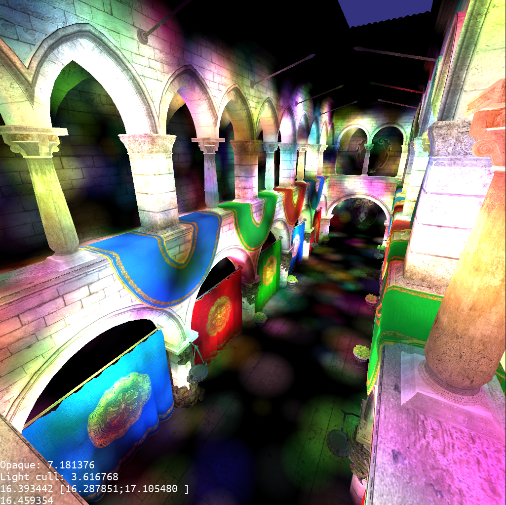
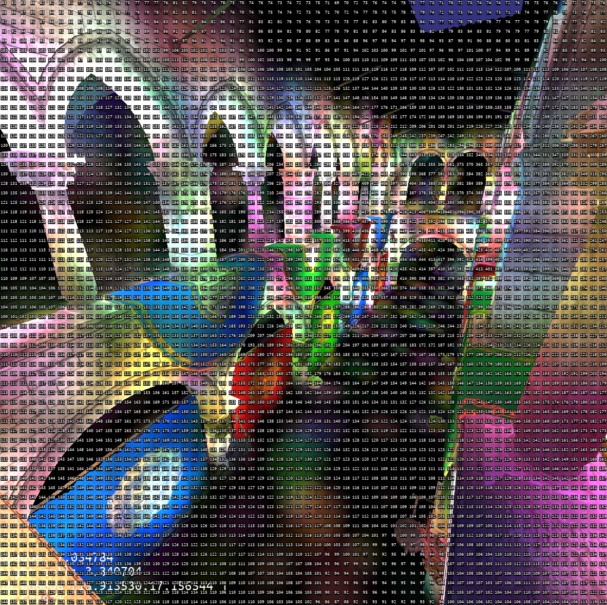
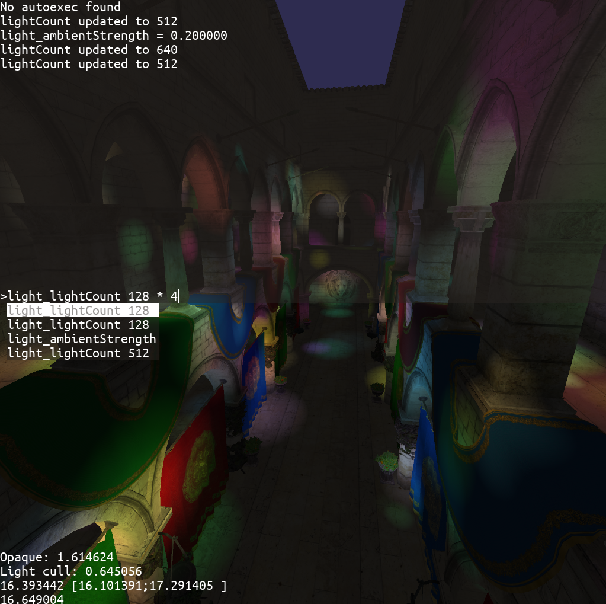

# Adaptive tile-based forward renderer

Written for a thesis, this code is undocumented and I can't explain all parts of
it today. The readme contains **bolded** keywords for quick reading.

Each frame, all lights are culled against the tiles that make up the back
buffer. The implementation has a "traditional" implementation that simply culls
the lights on a per-tile basis, but the screenshots show the **"adaptive"
implementation** that uses a **tree structure on the GPU** and multiple dispatch
calls to accelerate the rendering. Unfortunately the code is so old and poorly
documented (it was to be used once and then thrown away) that I can't explain
exactly how it works.

Though old, it still serves as a conversation starter, and I can call myself a
graphics programmer since I have a repo with the Sponza.

## Screenshots

Scene with **12k+ lights** with a maximum of 512 lights per tile. Rendering times
can be seen in the bottom left, given in milliseconds, where "opaque" refers to
the time it took to render all the objects (transparency is disabled). "Light
cull" includes culling all the 12k lights for all tiles, creating a list of
which lights affect which tile.

2x msaa is activated.

Running on a laptop with an Intel i7-10750H and Nvidia RTX 2060 mobile

The same screenshot but showing how many lights affect each tile

## Console 
This project also features a console built upon a **custom GUI library** called
DGUI. Through the console it is possible to set variables and call C++
functions.

DGUI contains fully functional buttons, text areas, text fields, checkboxes,
dropdowns, among other things.

The console supports arithmetic expressions using a **shunting yard
algorithm**, **command history**, **command fuzzy autocompletion**.

## Tidbits

The content manager supports watching files for changes and triggering a **hot
reload of assets** when they are modified on disk